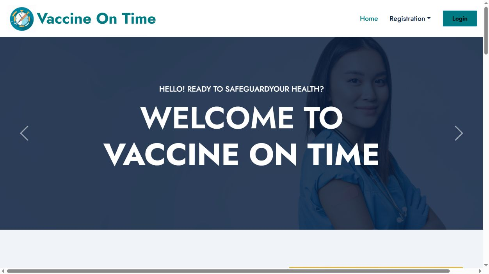
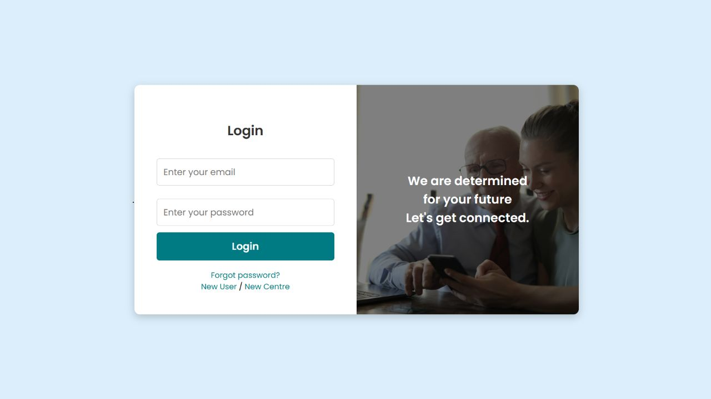
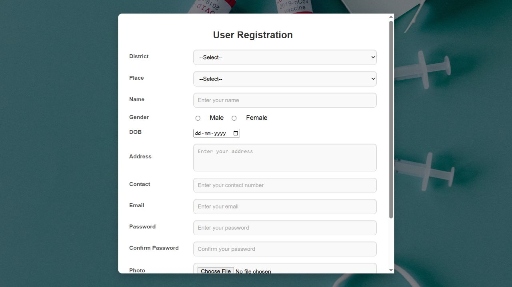

# Vaccine On Time

A PHP and MySQL vaccination booking project with separate workflows for users,
vaccination centres, and administrators. Users can find centres, view slots,
book vaccinations, and receive confirmation emails. Centres manage availability
and stock, while administrators manage vaccines and centre registrations.

## Screenshots

### Home



### Login



### User registration



Screenshots were captured from the application running locally in XAMPP.

## Features

| Role | Features |
| --- | --- |
| User | Registration and login, centre search, slot selection, vaccine booking, booking history, profile editing, feedback and complaints |
| Vaccination centre | Registration, vaccine offerings and pricing, stock management, slot management, booking view, profile editing and complaints |
| Administrator | Vaccine and category management, district and place management, centre approval, booking overview and complaint replies |
| Email | Booking confirmation and OTP-based password reset using PHPMailer and Gmail SMTP |

The payment screen is a demonstration flow that updates booking status; it does
not integrate a payment gateway or process real card payments.

## Technology

- PHP with MySQLi
- MySQL / MariaDB
- HTML, CSS, JavaScript, Bootstrap and jQuery
- PHPMailer for SMTP email
- Apache and phpMyAdmin through XAMPP

## Run locally with Windows and XAMPP

This is the setup used for local verification. The repository contains source
code; opening the GitHub page does not run the PHP application.

### 1. Get the project

With Git installed, open PowerShell and run:

```powershell
cd C:\xampp\htdocs
git clone https://github.com/chinmaiunni/Vaccine-On-Time.git Vaccineontime
```

Alternatively, use **Code → Download ZIP** on GitHub. Extract it and place the
project in `C:\xampp\htdocs\Vaccineontime`. That folder should directly contain
`DB`, `PROJECT`, and this README, without an extra nested ZIP folder.

### 2. Start the services

Open the XAMPP Control Panel and start **Apache** and **MySQL**.
Use a PHP installation with the `mysqli` extension; SMTP over SSL also needs
OpenSSL. Frontend fonts and some icons load from external services and need
internet access.

### 3. Import the database

1. Open [phpMyAdmin](http://localhost/phpmyadmin/).
2. Create an empty database named `db_vaccine`.
3. Select it, open **Import**, and choose `DB/db_vaccine.sql`.
4. Complete the import. This export includes saved vaccines, categories,
   centres, accounts, slots, and other project data.

Import only one SQL file. `db_vaccine (1).sql` is an alternative export;
`schema.sql` contains tables only and will not populate the application.
Import into a new empty database, not an existing working installation.

### 4. Check the database connection

`PROJECT/Assets/connection/connection.php` uses these local defaults:

| Setting | Value |
| --- | --- |
| Host | `localhost` |
| Username | `root` |
| Password | Empty string |
| Database | `db_vaccine` |

If your MySQL configuration differs, update that file locally to match it.

### 5. Configure email before testing email workflows

The real SMTP credentials are deliberately excluded from Git. On your computer,
copy the example configuration:

```powershell
cd C:\xampp\htdocs\Vaccineontime
Copy-Item PROJECT\Assets\connection\smtp.example.php PROJECT\Assets\connection\smtp.local.php
```

Edit the new `smtp.local.php` file and fill in:

- `username`: the Gmail address you will send from.
- `password`: that account's Gmail app password.
- `from`: the same sender address.

The application uses `smtp.gmail.com`, SSL, and port `465`. Keep
`smtp.local.php` private; `.gitignore` excludes it from commits.
See [SMTP setup notes](PROJECT/Assets/connection/SMTP_SETUP.md).

You can browse and register without sending email. Booking confirmation and
forgot-password workflows require a working SMTP configuration; they can fail
if this file is missing or its credentials are invalid. For email testing, use
a recipient email address you control.

### 6. Open the website

Open [Vaccine On Time locally](http://localhost/Vaccineontime/PROJECT/index.php).

Use this exact URL if you followed the folder naming above. Open it through
Apache, rather than double-clicking a PHP file or using VS Code Live Server.

## Suggested review walkthrough

1. Explore the home page and open **Login**.
2. Choose **New User** to create your own test account, then sign in.
3. Browse vaccination centres and available vaccines and slots.
4. With SMTP configured, try a demo booking and check the confirmation email.
5. Review the booking history, profile, feedback, and complaint pages.
6. Test **Forgot password?** using your registered email address.

For administrator or centre workflows, use a matching account from your local
imported database. The login page routes each role to its own dashboard.
The included export is a saved snapshot: slot dates and stock may need updating
through a centre account before a new booking can be demonstrated.

## Project layout

```text
DB/                       Database exports and setup notes
PROJECT/
  index.php               Public homepage
  Guest/                  Registration, login and password recovery
  Users/                  User booking and account pages
  VaccineCenter/          Centre management pages
  Admin/                  Administration pages
  Assets/                 Styles, scripts, uploads, PHPMailer and configuration
docs/screenshots/         README screenshots
```

## Troubleshooting

| Problem | What to check |
| --- | --- |
| Local page does not open | Apache is running, the project is under `htdocs`, and the URL matches the extracted folder name. |
| Database connection error | MySQL is running, `db_vaccine` exists, and the connection settings match your machine. |
| Missing tables or data | Import `DB/db_vaccine.sql` into an empty database, rather than the structure-only export. |
| Booking or reset email fails | Create `smtp.local.php`, configure valid sender credentials, and check SMTP connectivity. |
| No suitable slots | Review centre stock and slot dates; the database export is a historical snapshot. |
| Include errors on Linux | Some existing PHP includes use different filename capitalization. The documented setup uses Windows; review path casing before running on a case-sensitive filesystem. |

## Local verification

- Home, login, and registration pages opened through local Apache.
- Booking confirmation and forgot-password emails were confirmed in the
  project's existing local setup after moving SMTP credentials out of source code.
- These checks do not constitute a fresh-install or production deployment test.
